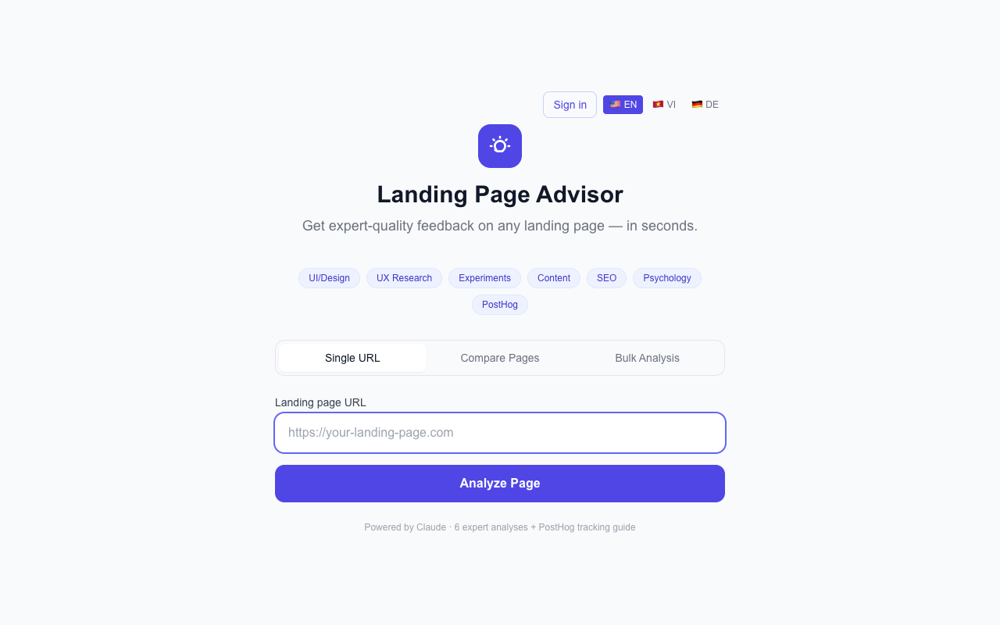
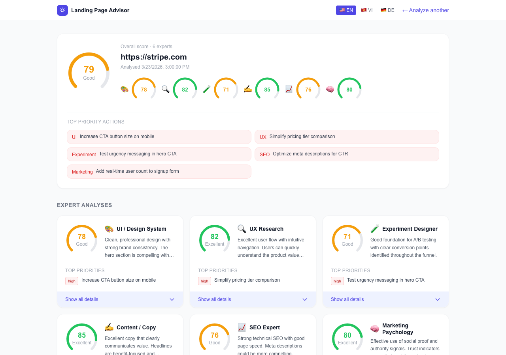

# Landing Page Advisor

AI-powered landing page analysis tool. Paste any URL and get expert-quality feedback from 6 specialist perspectives (UI/Design, UX Research, Experiment Design, Content/Copy, SEO, Marketing Psychology) plus a tailored PostHog tracking plan.

Supports **Anthropic Claude** and **OpenAI GPT** as interchangeable AI backends.

## Screenshots

**Landing Page** — paste any URL and choose your analysis mode:



**Results Dashboard** — overall score, top actions, and 6 expert cards with per-expert scores, strengths, weaknesses, and recommendations:



## Prerequisites

- **Node.js** 18+ and **npm**
- An **Anthropic API key** ([console.anthropic.com](https://console.anthropic.com/)) **and/or** an **OpenAI API key** ([platform.openai.com](https://platform.openai.com/))

## Quick Start

```bash
# 1. Clone / navigate to the project
cd /Users/github/martech

# 2. Install dependencies (already done if node_modules exists)
npm install

# 3. Configure your AI provider
cp .env.local.example .env.local
# Edit .env.local — set AI_PROVIDER and the matching API key (see below)

# 4. Start the dev server
npm run dev
```

Open [http://localhost:3000](http://localhost:3000) in your browser.

## Usage

1. Enter any public landing page URL (e.g. `https://stripe.com`)
2. Click **Analyze Page** — the loading screen shows which expert is currently working
3. View the results dashboard:
   - **Overall score** (average of all 6 experts, 0–100)
   - **Top priority actions** — highest-impact cross-expert recommendations
   - **6 Expert Cards** — per-expert score, summary, strengths, weaknesses, recommendations
   - **PostHog Tracking Plan** — copy-paste JS snippets for each recommended tracking event

## Project Structure

```
src/
├── app/
│   ├── page.tsx                  # URL input form (home page)
│   ├── analyze/page.tsx          # Results dashboard
│   ├── api/analyze/route.ts      # POST /api/analyze — analysis pipeline
│   └── layout.tsx
├── components/
│   ├── ExpertCard.tsx            # Per-expert score + recommendations card
│   ├── ScoreGauge.tsx            # 0-100 visual score indicator
│   ├── PostHogGuide.tsx          # Tabbed PostHog tracking guide
│   └── LoadingExpert.tsx         # Animated pipeline progress
└── lib/
    ├── scraper.ts                # Cheerio HTML scraper
    ├── ai-provider.ts            # Provider abstraction (Claude / OpenAI)
    ├── posthog-advisor.ts        # PostHog tracking advisor prompt
    └── experts/
        ├── types.ts              # Shared TypeScript interfaces
        ├── ui-design.ts          # UI/Design System expert prompt
        ├── ux-research.ts        # UX Research expert prompt
        ├── experiment.ts         # Experiment Designer expert prompt
        ├── content.ts            # Content/Copy expert prompt
        ├── seo.ts                # SEO expert prompt
        └── psychology.ts         # Marketing Psychology expert prompt
```

## API

### `POST /api/analyze`

**Request:**
```json
{ "url": "https://your-landing-page.com" }
```

**Response:**
```json
{
  "url": "https://...",
  "analysedAt": "2026-03-22T10:00:00.000Z",
  "experts": {
    "ui-design": {
      "score": 72,
      "summary": "...",
      "strengths": ["..."],
      "weaknesses": ["..."],
      "recommendations": [
        { "priority": "high", "action": "...", "impact": "..." }
      ]
    },
    "ux-research": { ... },
    "experiment": { ... },
    "content": { ... },
    "seo": { ... },
    "psychology": { ... }
  },
  "posthog": {
    "trackingPoints": [
      {
        "element": "Hero CTA button",
        "event": "cta_clicked",
        "properties": { "location": "hero" },
        "codeSnippet": "posthog.capture('cta_clicked', { location: 'hero' })"
      }
    ],
    "keyMetrics": ["cta_clicked", "form_submitted"],
    "strategy": "..."
  }
}
```

## AI Provider Configuration

The app supports **Claude** (default) and **OpenAI** as interchangeable backends.

### Using Claude (default)

```env
AI_PROVIDER=claude
ANTHROPIC_API_KEY=sk-ant-...
# CLAUDE_MODEL=claude-sonnet-4-6   # optional
```

### Using OpenAI

```env
AI_PROVIDER=openai
OPENAI_API_KEY=sk-...
# OPENAI_MODEL=gpt-4o   # optional
```

### Auto-detection

If `AI_PROVIDER` is not set, the app checks for `ANTHROPIC_API_KEY` first, then `OPENAI_API_KEY`.

## Environment Variables

| Variable | Required | Description |
|----------|----------|-------------|
| `AI_PROVIDER` | No | `claude` (default) or `openai` |
| `ANTHROPIC_API_KEY` | Claude only | Your Anthropic API key |
| `CLAUDE_MODEL` | No | Override Claude model (default: `claude-sonnet-4-6`) |
| `OPENAI_API_KEY` | OpenAI only | Your OpenAI API key |
| `OPENAI_MODEL` | No | Override OpenAI model (default: `gpt-4o`) |

## Build & Lint

```bash
npm run build   # Production build
npm run lint    # ESLint
npm run start   # Start production server (after build)
```

## Tech Stack

- **Next.js 14** (App Router, TypeScript)
- **Tailwind CSS**
- **Anthropic SDK** (`@anthropic-ai/sdk`) + **OpenAI SDK** (`openai`) — provider-agnostic via `src/lib/ai-provider.ts`
- **Cheerio** — server-side HTML scraping

## Notes

- The app **scrapes the target URL server-side** — the page must be publicly accessible
- Analysis runs **6 expert AI calls in parallel**, then 1 PostHog advisor call sequentially — expect ~15–30s total
- Results are stored in `sessionStorage` and are not persisted between browser sessions
- PostHog snippets are recommendations only — no PostHog SDK is installed in this app
